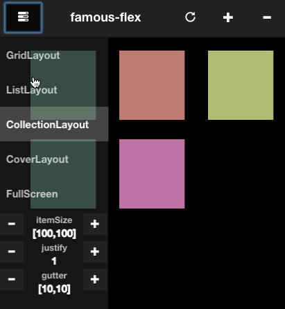

 

Animatable layouts, FlexScrollView & widgets for famo.us.



Above anything, famous-flex is a concept in which renderables are seperated from how
they are layed-out. This makes it possible to change layouts on the fly and animate
the renderables from one layout to another. For instance, you can layout a collection
of renderables using a `CollectionLayout`, and change that into a `ListLayout`. When using
`flow`-mode the renderables will smoothly transition from the old state to the new state using physics, particles and springs.

## Mixed-mode support

famous-flex was written for the v0.3.x API of famo.us. The new mixed-mode API of famo.us is drastically different
and famous-flex therefore needs to be ported to the new API and engine. Some parts will need to be upgraded while others will need to be rewritten from scratch. Also, BEST integration needs to be added. A new branch called 'mixed-mode' will be created on which all mixed-mode development will take place, starting with a LayoutController and the core layouts. After that the Scrolling support shall be added and finally the widgets.

In order to make this happen, community contributions would be very welcome to speed up the process. If you want to help, please drop me a line at hrutjes@gmail.com. Also, donations are very welcome and will allow me to spent more time on migrating to mixed-mode and on new famous-flex features. If you want to donate, [click here](https://www.paypal.com/cgi-bin/webscr?cmd=_s-xclick&hosted_button_id=6PV9ACCZS43VJ).


### Demos

- [famous-flex-demo](https://rawgit.com/IjzerenHein/famous-flex-demo/master/dist/index.html) ([source](https://github.com/IjzerenHein/famous-flex-demo))
- [AnimationController demo](https://rawgit.com/IjzerenHein/famous-flex-animationcontroller/master/dist/index.html) ([source](https://github.com/IjzerenHein/famous-flex-animationcontroller))
- [Chat demo](https://rawgit.com/IjzerenHein/famous-flex-chat/master/dist/index.html) ([source](https://github.com/IjzerenHein/famous-flex-chat))
- [DatePicker demo](https://rawgit.com/IjzerenHein/famous-flex-datepicker/master/dist/index.html) ([source](https://github.com/IjzerenHein/famous-flex-datepicker))
- [TabBar demo](https://rawgit.com/IjzerenHein/famous-flex-tabbar/master/dist/index.html) ([source](https://github.com/IjzerenHein/famous-flex-tabbar))
- [TabBarController demo](https://rawgit.com/IjzerenHein/famous-flex-tabbarcontroller/master/dist/index.html) ([source](https://github.com/IjzerenHein/famous-flex-tabbarcontroller))


### Getting started
- [Installation](#installation)

### Core concepts
- [LayoutController](#layoutcontroller)
- [Layout function](#layout-function)
- [Datasource](#datasource)
- [Layout literals](#layout-literals)
- [Layout helpers](#layout-helpers)

### Views / widgets
- [LayoutController](docs/LayoutController.md)
- [AnimationController](https://github.com/IjzerenHein/famous-flex-animationcontroller/blob/master/tutorial/AnimationController.md)
- [ScrollController](docs/ScrollController.md)
- [FlexScrollView](tutorials/FlexScrollView.md)
- [DatePicker](https://github.com/IjzerenHein/famous-flex-datepicker/blob/master/tutorial/DatePicker.md)
- [TabBar](https://github.com/IjzerenHein/famous-flex-tabbar/blob/master/tutorial/TabBar.md)
- [TabBarController](https://github.com/IjzerenHein/famous-flex-tabbarcontroller/blob/master/tutorial/TabBarController.md)

### [Layouts](#standard-layouts)
- [ProportionalLayout](docs/layouts/ProportionalLayout.md)
- [HeaderFooterLayout](docs/layouts/HeaderFooterLayout.md)
- [NavBarLayout](docs/layouts/NavBarLayout.md)
- [TabBarLayout](docs/layouts/TabBarLayout.md)
- [ListLayout](docs/layouts/ListLayout.md) *(scrollable)*	
- [CollectionLayout](docs/layouts/CollectionLayout.md) *(scrollable)*
- [WheelLayout](docs/layouts/WheelLayout.md) *(scrollable)*

### Resources
- [Documentation](#documentation)
- [Roadmap](#roadmap)


## Installation

Install using bower or npm:

	bower install famous-flex

	npm install famous-flex

## LayoutController

[LayoutController](docs/LayoutController.md) is a view that lays out renderables based on:
- a layout-function
- a data-source containing renderables
- optional layout-options

Example of laying out renderables using a CollectionLayout:

```javascript
var LayoutController = require('famous-flex/LayoutController');
var CollectionLayout = require('famous-flex/layouts/CollectionLayout'); // import standard layout

// create collection-layout
var layoutController = new LayoutController({
	layout: CollectionLayout,
	layoutOptions: {
		itemSize: [100, 100],
		gutter: [20, 20],
		justify: true
	},
	flow: true,    // smoothly animates renderables when changing the layout
	direction: 1,  // 0 = X, 1 = Y, undefined = use default from selected layout-function
	dataSource: [
		new Surface({content: 'surface1'}),
		new Surface({content: 'surface2'}),
		new Surface({content: 'surface3'})
	]
});
this.add(layoutController); // add layout-controller to the render-tree
```

When the `flow` option is enabled, renderables are animated smoothly between
layout states.


## Layout function

A layout is represented as a `Function`, which takes a `context` argument and
an optional `options` argument. The purpose of the function is to lay-out the
renderables in the data-source by calling `context.set()` on a renderable. The
renderables can be enumerated by calling `context.next()`, `context.prev()` or
by using the id of the renderable.

Famous-flex comes shipped with various [standard layouts](#standard-layouts), but
it is also very easy to create your own layout-functions.
View [LayoutContext](docs/LayoutContext.md) for more details on creating your own
layout-functions.

```javascript
/**
 * @param {LayoutContext} context Context used for enumerating renderables and setting the layout
 * @param {Object} [options] additional layout-options that are passed to the function
 */
function LayoutFunction(context, options) {

	// simple layout-function that lays out renderables from top to bottom
	var node = context.next();
	var y = 0;
	while (node) {
		context.set(node, {
			size: [context.size[0], 100],
			translate: [0, y, 0]
		});
		y += 100;
		node = context.next();
	}
};
```

For optimal performance, the layout function is only executed when:
- A resize occurs
- An option is changed on the layout-controller
- When the content is scrolled


## Datasource

The data-source contains the renderables that are to be layed-out.
It can be one of three things:

- An `Array`
- A `ViewSequence`
- An `Object` with key/value pairs

In case of an `Array` or `ViewSequence`, use `context.next()` in your
layout-function to enumerate all the renderables in the data-source:

```javascript
var layoutController = new LayoutController({
	layout: function (context, options) {
		var y = 0;
		var node = context.next();
		while (node) {
			context.set(node, {
				size: [context.size[0], 100],
				translate: [0, y, 0]
			});
			y += 100;
			node = context.next();
		}
	},
	dataSource: [
		new Surface({content: 'surface1'}),
		new Surface({content: 'surface2'}),
		new Surface({content: 'surface3'})
	]
});
```

Sometimes it is easier to identify renderables by an id, rather than a
sequence. In that case use `context.get()` or directly pass the data-source id
to the `context.set()` function:

```javascript
var layoutController = new LayoutController({
	layout: function (context, options) {
		context.set('one', {
			size: [100, 100],
			translate: [0, 0, 0]
		});
		context.set('two', {
			size: [100, 100],
			translate: [100, 0, 0]
		});
		context.set('three', {
			size: [100, 100],
			translate: [200, 0, 0]
		});
	},
	dataSource: {
		'one': new Surface({content: 'one'}),
		'two': new Surface({content: 'two'}),
		'three': new Surface({content: 'three'})
	}
});
```


## Layout literals

Layout literals are objects which describe layouts through a definition rather
than a function. The following example describes the use of a layout literal
using `dock` semantics (see [LayoutDockHelper](docs/helpers/LayoutDockHelper.md)):

```javascript
var layoutController = new LayoutController({
	layout: {dock: [
		['top', 'header', 50],
		['bottom', 'footer', 50],
		['fill', 'content']
	]},
	dataSource: {
		header: new Surface({content: 'Header'}),
		footer: new Surface({content: 'Footer'}),
		content: new Surface({content: 'Content'})
	}
});
```

Layout literals are implemented through LayoutHelpers. To create your own
layout literals, perform the following steps:
- Create a LayoutHelper (see [LayoutDockHelper](src/helpers/LayoutDockHelper.js) for an example).
- Implement the `parse` function on the LayoutHelper.
- Register the helper using `LayoutUtility.registerHelper`.


## Layout helpers

Layout helpers are special classes that simplify writing layout functions.

|Helper|Literal|Description|
|---|---|---|
|[LayoutDockHelper](docs/helpers/LayoutDockHelper.md)|`dock`|Layout renderables using docking semantics.|


## Standard layouts

|Layout|DataSource|Scrollable|Description|
|---|---|---|---|
|[ProportionalLayout](docs/layouts/ProportionalLayout.md)|ViewSequence / Array|No|Lays out renderables sequentially and sizes them proportionally.|
|[HeaderFooterLayout](docs/layouts/HeaderFooterLayout.md)|Id-based|No|Layout containing a top-header, bottom- footer and content.|
|[NavBarLayout](docs/layouts/NavBarLayout.md)|Id-based|No|Layout containing one or more left and right items and a title.|
|[TabBarLayout](docs/layouts/TabBarLayout.md)|Id-based|No|Tab-bar layout.|
|*Scrollable layouts:*|
|[ListLayout](docs/layouts/ListLayout.md)|ViewSequence / Array|Yes|List layout with margins, spacing and optionally sticky headers.|
|[CollectionLayout](docs/layouts/CollectionLayout.md)|ViewSequence / Array|Yes|Lays out renderables in a grid with a specific width & height.|
|[WheelLayout](docs/layouts/WheelLayout.md)|ViewSequence / Array|Yes|Lays out renderables in a wheel (slot-machine) formation.|


## Documentation

|Class|Description|
|---|---|
|[LayoutController](docs/LayoutController.md)|Lays out renderables and optionally animates between layout states.|
|[AnimationController](https://github.com/IjzerenHein/famous-flex-animationcontroller/blob/master/tutorial/AnimationController.md)|Animating between famo.us views in awesome ways.|
|[ScrollController](docs/ScrollController.md)|Scrollable LayoutController (base class for FlexScrollView).|
|[FlexScrollView](tutorials/FlexScrollView.md)|Flexible scroll-view with pull-to-refresh, margins & spacing and more good stuff.|
|[DatePicker](https://github.com/IjzerenHein/famous-flex-datepicker/blob/master/tutorial/DatePicker.md)|Date/time picker wheel.|
|[TabBar](https://github.com/IjzerenHein/famous-flex-tabbar/blob/master/tutorial/TabBar.md)|TabBar widget.|
|[TabBarController](https://github.com/IjzerenHein/famous-flex-tabbarcontroller/blob/master/tutorial/TabBarController.md)|TabBarController widget.|
|[LayoutContext](docs/LayoutContext.md)|Context used for writing layout-functions.|
|[LayoutUtility](docs/LayoutUtility.md)|Utility class containing helper functions.|
|[VirtualViewSequence](docs/VirtualViewSequence.md)|Infinite view-sequence which uses a factory delegate to create renderables.|


## Roadmap

Famous-flex is still in its infancy. I am commited in creating a first-class
layout-solution for famo.us that is as performant, pluggable and awesome as
can be. But to do this, I need your support and feedback. Let me know which of
features below are most important to you, by leaving a comment in the corresponding
issue.

- [AutoLayout](https://github.com/IjzerenHein/famous-flex/issues/3) (Cassowary constraints)
- [Drag & drop](https://github.com/IjzerenHein/famous-flex/issues/5) (Drag & drop renderables in a layout)
- [New widgets](https://github.com/IjzerenHein/famous-flex/issues/49) (Suggestions for new widgets)
- [New Layouts](https://github.com/IjzerenHein/famous-flex/issues/50) (Suggestions for new layouts)


## Contribute

If you like this project and want to support it, show some love
and give it a star.


## Contact
- 	@IjzerenHein
- 	http://www.gloey.nl
- 	hrutjes@gmail.com (for hire)

© 2014 - 2015 Hein Rutjes
