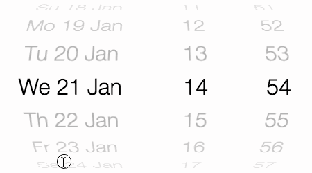

DatePicker
==========

DatePicker is a date/time picker-wheel based on the famous-flex LayoutController technology. It combines one or more
ScrollControllers using the WheelLayout layout to form a single date/time picker control.



# Index

- [Getting started](#getting-started)
- [API reference](../docs/widgets/DatePicker.md)
- [Getting and setting the selected date](#getting-and-setting-the-selected-date)
- [Events](#events)
- [Customizing the appearance](#customizing-the-appearance)
    - [CSS classes](#css-classes)
    - [Internationalisation & custom formatting](#internationalisation--custom-formatting)
    - [Adding overlay renderables](#adding-overlay-renderables)
- [Components](#components)
    - [Customizing components](#customizing-components)
- [Disabling user-input](#disabling-user-input)
- [Advanced topics](#advanced-topics)
    - [Using custom renderables](#using-custom-renderables)

# Getting started

To use the DatePicker in your project, install famous-flex using npm or bower:

    npm install famous-flex

    bower install famous-flex

To create the DatePicker use:

```javascript
var DatePicker = require('famous-flex/widgets/DatePicker');

var datePicker = new DatePicker({
    date: new Date(),        // initial date
    wheelLayout: {           // layout-options that are passed to the `WheelLayout`
        itemSize: 100,       // height of an item on the date/wheel
        diameter: 300        // diameter of the wheel (undefined = 3 x itemSize)
    }
});
datePicker.setComponents([
    new DatePicker.Component.FullDay(),  // full-day component (year + month + day)
    new DatePicker.Component.Hour(),     // hour component (0..23)
    new DatePicker.Component.Minute()    // minute compoent (0..59)
]);
this.add(datePicker); // add to the render-tree
```

Specify your preferred style for an item in the CSS-file:

```css
.famous-flex-datepicker .item > div {
    text-align: center;
    font-size: 40px;
    line-height: 60px; /* this should equal the WheelLayout itemSize */
}
```

# Getting and setting the selected date

To get and set the date, use `getDate` and `setDate`:

```javascript
// To set the initial date, specify it in the constructor
datePicker = new DatePicker({
    date: new Date(), // specify initial date
    ...
});

// Get and set the date
datePicker.setDate(new Date());
var date = datePicker.getDate();
```

# Events

When the date-wheels are scrolled or `setDate` is called, the following
events are emitted:

|event        |description|
|-------------|-----------|
|`scrollstart`|Emitted when scrolling starts.|
|`datechange` |Emitted immediately whenever the selected date changes.|
|`scrollend`  |Emitted after scrolling stops (after all the scroll particle have settled).|

To capture the newly selected date/time, use either `datechange` or
`scrollend`:

```javascript
// The `datechange` event is emitted immediately after the date
// has been changed.
datePicker.on('datechange', function(event) {
    console.log('date-changed to: ' + event.date.toString());
});

// The `scrollend` event is emitted after all date-wheel
// components have come to a halt.
datePicker.on('scrollend', function(event) {
    console.log('scrolling has ended: ' + event.date.toString());
});

```

# Customizing the appearance

The options for the DatePicker can be specified in the constructor
or using `setOptions`:

```javascript
var datePicker = new DatePicker({
    perspective: 2000,     // perspective used for the wheel layout
    wheelLayout: {         // layout-options that are passed to the `WheelLayout`
        itemSize: 50,      // height of single item on the date-wheel
        diameter: 200,     // diameter of the wheel in pixels
        radialOpacity: 0.5 // opacity at the top & bottom edges of the wheels
    }
});
datePicker.setComponents([
    // use `sizeRatio' to define the width of each component
    new DatePicker.Component.Hour({sizeRatio: 5}),   // 50% width
    new DatePicker.Component.Minute({sizeRatio: 2}), // 20% width
    new DatePicker.Component.Second({sizeRatio: 3}), // 30% width
]);
```

## CSS classes

At the topmost level, the DatePicker consists of a ContainerSurface using
the class `famous-flex-datepicker`. This class can be modified, by specifying
the `container` option in the constructor:

```javascript
var datePicker = new DatePicker({
    container: {
        classes: ['famous-flex-datepicker'] // specify your custom class(es) here
    }
});
```

Each item in the DatePicker is assigned the class `item` and a class which
corresponds to the component (e.g. `year`, `hour`, `weekday`, ...).
To for instance set the line-height and font-size for all components, use:

```css
.famous-flex-datepicker .item {
    text-align: center;
    font-size: 40px;
    line-height: 100px;
}
```

To customize a specific component, use its css-class:

```css
.famous-flex-datepicker .year {
    text-align: left;
}
```

## Internationalisation & custom formatting

By default the `Month` and `WeekDay` components are formatted in English.
If you want to format a component using a different locale, use the
formatting library of your choice. The following example uses [momentjs](http://momentjs.com) to format the month in the currently selected locale:

```javascript
var moment = require('moment/moment');

var datePicker = new DatePicker({..});
datePicker.setComponents([
    new DatePicker.Component.Year(),
    new DatePicker.Component.Month({
        // uses momentjs to format the full month in the current locale
        format: function(date) {
            return moment(date).format('MMMM');
        }
    }),
    new DatePicker.Component.Day()
]);
```

## Adding overlay renderables

Overlay renderables can be added which are then displayed in-front of the date-picker.
The following example adds top & bottom overlay renderables, which are slightly
white-transparent, making the middle section stand out more:

```javascript
var datePicker = new DatePicker({...});
datePicker.setOverlay({
    top: new Surface({
        classes: ['datepicker-overlay-top']
    },
    // middle: new Surface({...}),
    bottom: new Surface({
        classes: ['datepicker-overlay-bottom']
    }
});
```
CSS:

```css
.datepicker-overlay-top, .datepicker-overlay-bottom {
  background-color: rgba(255, 255, 255, 0.6);
  /* disable pointer events so that the surface doesn't interfere with scrolling */
  pointer-events: none;
}
.datepicker-overlay-top {
  border-bottom: 1px solid #777777;
}
.datepicker-overlay-bottom {
  border-top: 1px solid #777777;
}
```

# Components

DatePicker is shipped with various components out of the box.

|Component|CSS-class|Description|
|---|---|---|
|`DatePicker.Component.Year`|`.year`|4 digit year component.|
|`DatePicker.Component.Month`|`.month`|Month component (e.g. 'July').|
|`DatePicker.Component.FullDay`|`.fullday`|Full day component including year, month & day.|
|`DatePicker.Component.WeekDay`|`.weekday`|Day of the week (e.g. 'Monday').|
|`DatePicker.Component.Day`|`.day`|1 or 2 digit day of the month (e.g. 31).|
|`DatePicker.Component.Hour`|`.hour`|2 digit hour component.|
|`DatePicker.Component.Minute`|`.minute`|2 digit minute component.|
|`DatePicker.Component.Second`|`.second`|2 digit second component.|
|`DatePicker.Component.Millisecond`|`.millisecond`|3 digit millisecond component.|

## Customizing components

All components share a set of properties which can customized:

|Property|Type|Description|
|---|---|---|
|`sizeRatio`|`Number`|Width-ratio the component occupies in the date-picker (the sum of all sizeRatio's equals a width of 100%).|
|`step`|`Number`|The value by which the component is incremented/decremented when scrolling up/down.|
|`loop`|`Bool`|When set to `true` causes the component to loop when min/max is reached (default: `true`).|
|`format`|`Function`|Function that formats the component into a string (see [Internationalisation & custom formatting](#internationalisation--custom-formatting)).|
|`create`|`Function`|Function that creates the renderable for an item (see [Using custom renderables](#using-custom-renderables)).|

Example:

```javascript
var datePicker = new DatePicker();
datePicker.setComponents([
    new DatePicker.Component.FullDay({
        sizeRatio: 5,   // occupy 50% width
        format: function (date) {
            // format the date the way you want
            return date.toLocaleDateString();
        }
    }),
    new DatePicker.Component.Hour({
        sizeRatio: 2.5  // occupy 25% width
    }),
    new DatePicker.Component.Minute({
        step: 15,       // Select increments of 15 minutes
        sizeRatio: 2.5  // occupy 25% width
    })
]);
```

# Disabling user-input

To disable user scrolling (e.g. to build a clock), set the `enabled` option of the underlying
scroll-controllers to `false`, like this:

```javascript
var datePicker = new DatePicker({
    scrollController: {
        enabled: false
    }
});
```

You can use this method to override any of the default options of the underlying ScrollControllers.

# Advanced topics

## Using custom renderables

By default the date-picker creates a Surface with class `item` for each item in a component. Instead of using this Surface you can also create
your own surfaces or views. To do this, override the `create` method for each component:

```javascript
function createRenderable(date) {
    date = date || new Date();
    var surface = new Surface({
        classes: ['mydatepickeritem'],
        content: this.format(date)
    });
    surface.date = date;
    return surface;
}

datePicker.setComponents([
    new DatePicker.Component.FullDay({
        create: createRenderable
    });
]);
```

*© 2015 IjzerenHein*
