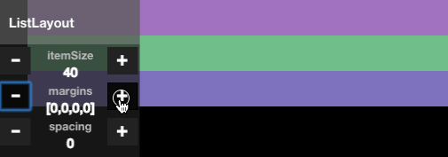
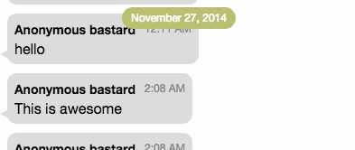
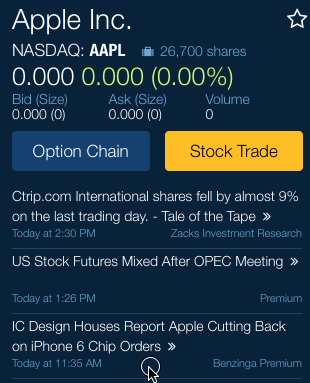

FlexScrollView
==========

FlexScrollView is a high performance scroll-view for famo.us based on the famous-flex LayoutController technology. The scrollview separates the actual layout algorithm from the scrollview, making it possible to select any layout into the scrollview.

By default FlexScrollView uses the [ListLayout](../docs/layouts/ListLayout.md) layout, which supports features such as [sticky headers](#sticky-headers-listlayout) and [margins & spacing](#margins--spacing-listlayout).


# Index

- [Getting started](#getting-started)
- [API reference](../docs/ScrollView.md)
- [Flow mode animations](#flow-mode-animations)
- [Collection layout](#collection-layout)
- [Pagination](#pagination)
- [Inserting & removing items](#inserting--removing-items)
    - [Auto event piping](#auto-event-piping)
- [Getting the visible item(s)](#getting-the-visible-items)
- [Scrolling](#scrolling)
- [Margins & spacing](#margins--spacing-listlayout)
- [Direction & alignment](#direction--alignment)
- [Clipping & ContainerSurfaces](#clipping--containersurfaces)
- [Pull to refresh](#pull-to-refresh)
- [Sticky headers](#sticky-headers-listlayout)
- [Advanced effects](#advanced-effects)
    - [Embedded scrollview linking](#embedded-scrollview-linking)
    - [Embedded scrollview scrolling restrictions](#embedded-scrollview-scrolling-restrictions)

# Getting started

To use the FlexScrollView in your project, install famous-flex using npm or bower:

    npm install famous-flex

    bower install famous-flex

To create the FlexScrollView use:

```javascript
var FlexScrollView = require('famous-flex/ScrollView');

var scrollView = new FlexScrollView();
this.add(scrollView);
```

# Flow mode animations

By enabling `flow` mode, renderables are smoothly transitioned to their new state whenever items are inserted, removed or the scrollview is resized.


The effect as seen above is created by setting the following options:

```javascript
var scrollView = new FlexScrollView({
    flow: true,             // enable flow-mode (can only be enabled from the constructor)
    insertSpec: {           // render-spec used when inserting renderables
        opacity: 0          // start opacity is 0, causing a fade-in effect,
        //size: [0, 0],     // uncommented to create a grow-effect
        //transform: Transform.translate(-300, 0, 0) // uncomment for slide-in effect
    },
    //removeSpec: {...},    // render-spec used when removing renderables
    nodeSpring: {           // spring-options used when transitioning between states
        dampingRatio: 0.8,  // spring damping ratio
        period: 1000        // duration of the animation
    }
});
```

# Collection layout

Any layout can be selected into the FlexScrollView. Even layouts that do not support scrolling can be selected, in that case scrolling is disabled. For instance, to use the multi-cell CollectionLayout instead of the default ListLayout use:

```javascript
var CollectionLayout = require('famous-flex/layouts/CollectionLayout');

var scrollView = new FlexScrollView({
    layout: CollectionLayout,
    layoutOptions: {
        itemSize: [50, 50],
        margins: [50, 10, 50, 10],
        spacing: [10, 10]
    }
});
```


# Pagination

Pagination causes the scrollview to neatly align the renderables with the edge of the scrollview. This option is disabled by default. To enable it, set the `paginated` option to `true` in the constructor or using `setOptions`:

```javascript
var scrollView = new FlexScrollView({
    paginated: true
});
```


# Inserting & removing items

Inserting & removing items can be done in various ways.

When using the insert/push/remove, you can also specify a render-spec to animate the renderable when inserting/removing (possible when `flow` mode is enabled).

```javascript
scrollView.insert(0, new Surface({}));  // insert at the beginning
scrollView.insert(3, new Surface({}), {opacity: 0}); // insert after index 3, with fade-in effect
scrollView.insert(-1, new Surface({})); // insert after the end
scrollView.push(new Surface({}));       // insert after the end
scrollView.push(new Surface({}), {size: [0, 0]}); // insert with grow effect
scrollView.remove(0);                   // remove at index 0
scrollView.remove(-1, {opacity: 0});    // remove last item and fade-out
scrollView.removeAll();                 // removes all items
```

Using `setDataSource` or `sequenceFrom`:

```javascript
// Using an array
scrollView.setDataSource([surface1, surface2, ...]);
scrollView.sequenceFrom([surface1, surface2, ...]);

// Using a ViewSequence
var viewSequence = new ViewSequence();
viewSequence.push(surface1);
viewSequence.push(surface2);
viewSequence.push(...);
scrollView.setDataSource(viewSequence);
scrollView.sequenceFrom(viewSequence);
```

## Auto event piping

When inserting renderables, you typically have to pipe the events from the renderable to the scrollview. This step can be automated by enabling the `autoPipeEvents` option.

```javascript
var scrollView = new FlexScrollView({
    autoPipeEvents: true
});

// No need to call surface.pipe, the scrollview does this automatically for you.
scrollView.push(new Surface({
    content: 'My surface'
}));
```


# Getting the visible item(s)

To get the currently visible items, use the following functions:

```javascript
var arr = scrollView.getVisibleItems();       // array of completely or partially visible items
var first = scrollView.getFirstVisibleItem(); // first visible item
var last = scrollView.getLastVisibleItem();   // last visible item

var index = scrollView.getCurrentIndex();     // quickly get index of first visible item
```

The result of these functions is an object or array of objects with the following properties:

```javascript
var item = {
    index: number,           // index within the data-source
    renderNode: renderable,  // renderable that was added to the datasource
    viewSequence: node,      // view-sequence node associated with the renderable
    visiblePerc: [0..1]      // percentage of how much of the renderable is visible
};
```

The `getFirstVisibleItem` and `getLastVisibleItem` functions return the first or last item that is completely visible or the item that is partially visible and satisfies the `visibleItemThresshold` option. By default, this option is set to 0.5, which means that when an item is 50% percent visible, it is considered to be visible.


# Scrolling

To scroll the view use the following functions:

```javascript
scrollView.goToPage(index);              // scrolls to the renderable at the given index
scrollView.goToFirstPage();              // scrolls to the first renderable
scrollView.goToLastPage();               // scrolls to the last renderable
scrollView.goToPreviousPage();           // scrolls to the previous renderable
scrollView.goToNextPage();               // scrolls to the next renderable
scrollView.goToRenderNode(renderable);   // scrolls to the given renderable

scrollView.scroll(delta);                // scrolls x pixels in previous or next direction
var allowedDelta = canScroll(delta);     // tests whether the view can scroll the given delta
```

By default the FlexScrollView listens to touch-events and mouse-wheel (trackpad) events only. It is also possible to enable scrolling by pressing down on the mouse and moving the mouse. To enable this option use:

```javascript
var scrollView = new FlexScrollView({
    mouseMove: true
});
```

Sometimes it is useful to disable scrolling through user-inputs. To enable or disable scrolling use the `enabled` option:

```javascript
scrollView.setOptions({
    enabled: false   // disables scrolling through touch/trackpad/mouse events
});
```


# Margins & Spacing (ListLayout)



Margins and spacing are part of the ListLayout that is selected into the scrollview by default. They can be set in the constructor or by using the `setLayoutOptions()` function:

```javascript
var scrollView = new FlexScrollView({
    layoutOptions: {
        margins: [10, 5, 0, 15], // margins in clockwise order: top, right, bottom, left
        spacing: 5
    }
});
```

Instead of specifying all margins separately, you can also use the shorthand notation:

```javascript
scrollView.setLayoutOptions({ margins: 5 }); // set all margins to 5
scrollView.setLayoutOptions({ margins: [5] }); // set all margins to 5
scrollView.setLayoutOptions({ margins: [5, 10] }); // set top/bottom to 5, left/right to 10
```


# Direction & alignment

Both X and Y directions are supported. By default, content is layed out in the Y-direction. To set the direction, use the constructor options or the `setOptions` function:

```javascript
var Utility = require('famous/utilities/Utility');
var scrollView = new FlexScrollView({
    direction: Utility.Direction.X // set direction to horizontal
});

scrollView.setOptions({
    direction: Utility.Direction.Y // direction & alignment can be changed on the fly
});
```

By default, renderables are aligned to the top (for direction: Y) and to the left (for direction: X). In some cases you may want to align the renderables to the bottom or the right. A good example of this is a chat application. When a keyboard is shown on a tablet or phone, it shifts the whole screen up. In this case you want to align the renderables to the bottom for when the screen is resized.

To set the alignment, use the `alignment` option. The alignment option can have two values, 0 (default) which aligns to the top or left, and 1 for aligning to the bottom or right.

```javascript
// create a vertical scrollview which is aligned to the bottom
var scrollView = new FlexScrollView({
    direction: Utility.Direction.Y,
    alignment: 1
});
```


# Clipping & ContainerSurfaces

When you need to clip the contents of the scrollview so it doesn't overflow, you typically have create a ContainerSurface and embed the scrollview inside it. The FlexScrollView can perform this task for you through the `useContainer` option. When `useContainer` is set to `true`, the scrollview is wrapped inside a ContainerSurface with `overflow: hidden`:

```javascript
var scrollView = new FlexScrollView({
    useContainer: true // wraps scrollview inside a ContainerSurface with overflow: hidden
});
```


# Sticky headers (ListLayout)



To enable sticky headers, set the `isHeaderCallback` layout-option to a function which returns `true` when a renderable is a section:

```javascript
var scrollView = new FlexScrollView({
    layoutOptions: {
        isHeaderCallback: function(renderNode) {
            return renderNode.isHeader;
        }
    }
```

A header is a regular renderable, just like any other renderable. In the following example we add a property `isHeader` so the header can be detected by the `isHeaderCallback()` function. Also, the renderable is moved in front so that it overlaps non-header items.

```javascript
function _createHeader() {
    var surface = new Surface({..});
    surface.isHeader = true;
    var renderNode = new RenderNode(new Modifier({
        transform: Transform.infront
    }));
    renderNode.add(surface);
    return renderNode;
}
```

To add headers & items, just add them in the order that you want them to be displayed:

``` javascript
scrollView.push(_createHeader());
scrollView.push(new Surface({}));
scrollView.push(new Surface({}));
scrollView.push(_createHeader());
scrollView.push(new Surface({}));
```


# Pull to refresh


To enable pull to refresh, assign a renderable to the `pullToRefreshHeader` or `pullToRefreshFooter` option:

```javascript
var scrollView = new FlexScrollView({
    autoPipeEvents: true,
    pullToRefreshHeader: new Surface({
        size: [undefined, 50], // required
        content: 'pull to refresh header'
    }),
    pullToRefreshHeader: new Surface({...})
});
```

Whenever the user pulls on header or footer (the pull down height is 2x the height of the renderable), the `refresh` event is emitted:

```javascript
scrollView.on('refresh', function(event) {
    Timer.setTimeout(function() { // perform your refresh logic here

        // On completion, hide the pull to refresh header
        scrollView.hidePullToRefresh();
    }, 2000);
});
```

When using both header and footer pull to refresh, use `event.footer` to check which event was emitted:

```javascript
scrollView.on('refresh', function(event) {
    if (event.footer) {
        fetchNextPage(function() { // perform your logic here

            // when done, hide the pull to refresh footer
            scrollView.hidePullToRefresh(true);
        });
    }
    else {
        fetchPreviousPage(function() { // perform your logic here

            // when done, hide the pull to refresh header
            scrollView.hidePullToRefresh(false);
        });
    }
});
```

To programatically show or hide the pull to refresh renderables, use the following functions:

```javascript
scrollView.showPullToRefresh(footer);
scrollView.hidePullToRefresh(footer);
scrollView.isPullToRefreshVisible(footer);
```

To animate your pull to refresh renderable while pulling, create a custom view and implement the `setPullToRefreshStatus` on it. When pulling starts, stops or changes state, the FlexScrollView will call `setPullToRefreshStatus(state)` on the renderable to indicate these state changes.

See [famous-refresh-loader](https://github.com/IjzerenHein/famous-refresh-loader) for an example on how to create a responsive pull to refresh view.

Using RefreshLoader:
```javascript
var RefreshLoader = require('famous-refresh-loader/RefreshLoader');

var scrollView = new FlexScrollView({
    autoPipeEvents: true,
    pullToRefreshHeader: new RefreshLoader({
        size: [undefined, 60],
        pullToRefresh: true,
        color: 'green'
        backgroundColor: 'white',
        particleCount: 8,
        particleSize: 7
    })
});
```


# Advanced effects

## Embedded scrollview linking



The example above shows a scrollview embedded inside another scrollview. Whenever the bottom (news) scrollview reaches the top, it delegates the scroll-events to the outer scrollview, creating a seemless scrolling experience. To create this effect, set the `leadingScrollView` or `trailingScrollView` options in the constructor:

```javascript
// Create outer scrollview
var scrollView = new FlexScrollView({
    autoPipeEvents: true
});
scrollView.push(new Surface{
    size: [undefined, 100],
    content: 'top surface'
});

// Add embedded scrollview
var embeddedScrollView = new FlexScrollView({
    autoPipeEvents: true,
    leadingScrollView: scrollView
});
scrollView.push(embeddedScrollView, undefined, false); // add, but don't pipe-events!
embeddedScrollView.push(new Surface{
    size: [undefined, 100],
    content: 'top surface'
});
```

Similarly, this can be done for the bottom part of scrollview. In that case, set the `trailingScrollView` option in the constructor:

```javascript
var embeddedScrollView = new FlexScrollView({
    trailingScrollView: scrollView
});
```


## Embedded scrollview scrolling restrictions


When inserting a horizontal scrollview inside a vertical scrollview (or vice versa), both scrollview's respond to both vertical and horizontal input events. This is because no-one ever scrolls perfectly horizontal or vertical causing both scrollview's to scroll on their axes. To prevent both  scrollview's from scrolling, you can use the following technique:

```javascript
// Create vertical and horizontal scrollview and embed
// one scrollview inside the other one.
var vertScrollView = new FlexScrollView({
    touchMoveDirectionThresshold: 0.5
});
var horzScrollView = new FlexScrollView({
    touchMoveDirectionThresshold: 0.5
});
horzScrollView.push(vertScrollView);

// When the vertical scrollview starts scrolling, capture all events
// and disable scrolling on the horizontal scrollview
vertScrollView.on('scrollstart', function(event) {
    horzScrollView.setOptions({ enabled: false });
    vertScrollView.setOptions({ touchMoveDirectionThresshold: undefined });
});
vertScrollView.on('scrollend', function(event) {
    horzScrollView.setOptions({ enabled: true });
    vertScrollView.setOptions({ touchMoveDirectionThresshold: 0.5 });
});

// When the horizontal scrollview starts scrolling, capture all events
// and disable scrolling on the vertical scrollview
horzScrollView.on('scrollstart', function(event) {
    vertScrollView.setOptions({ enabled: false });
    horzScrollView.setOptions({ touchMoveDirectionThresshold: undefined });
});
horzScrollView.on('scrollend', function(event) {
    vertScrollView.setOptions({ enabled: true });
    horzScrollView.setOptions({ touchMoveDirectionThresshold: 0.5 });
});
```
